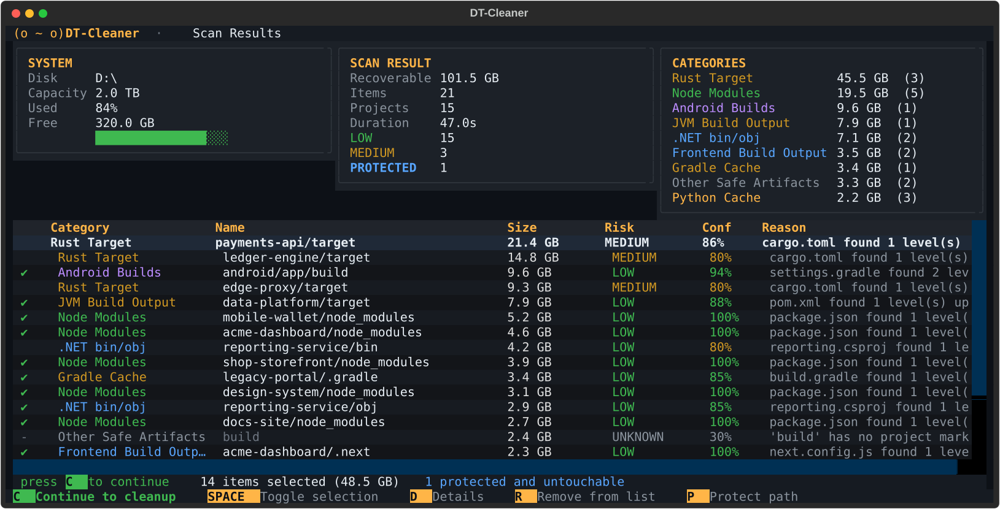
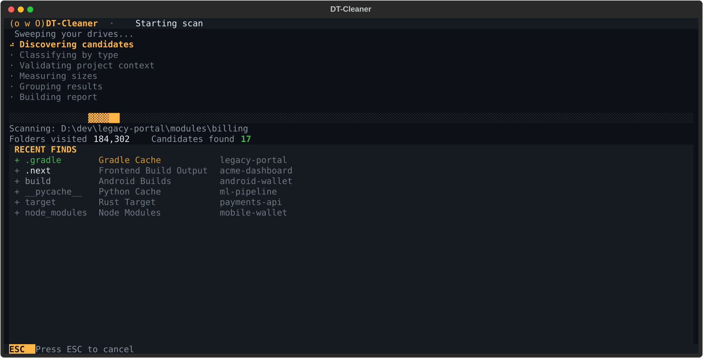
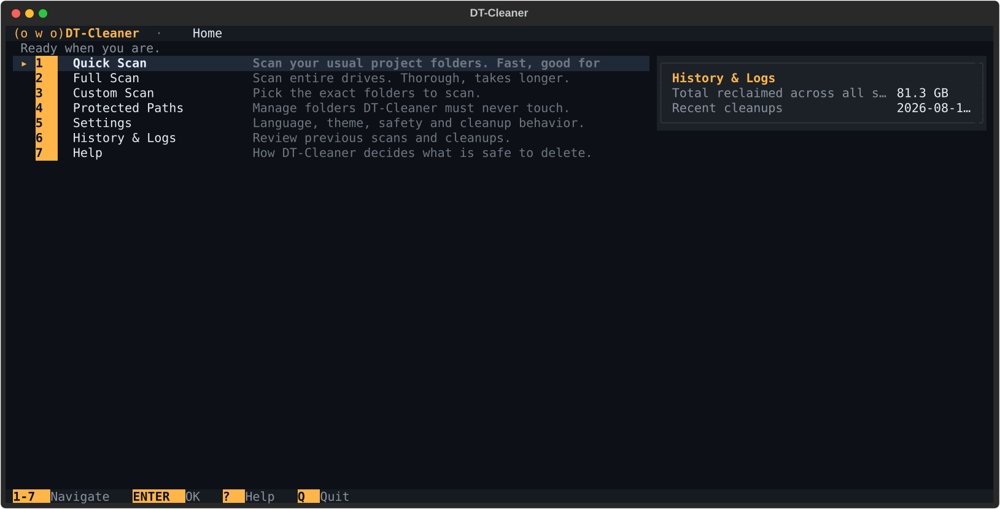
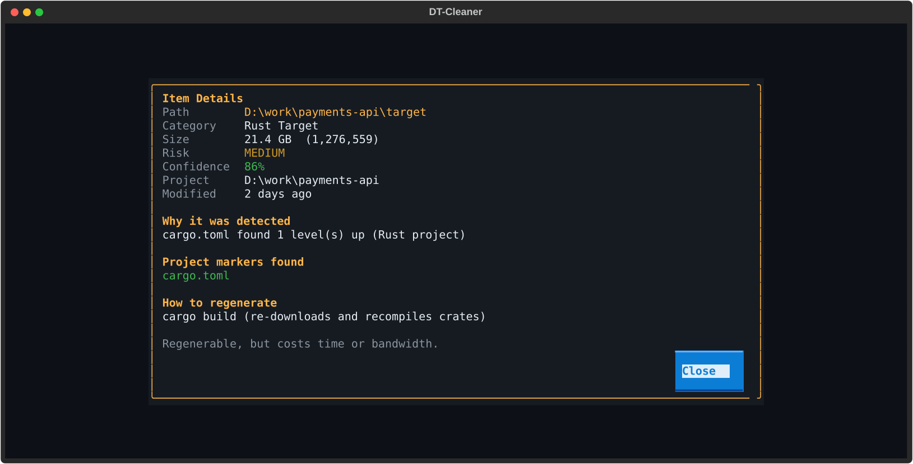
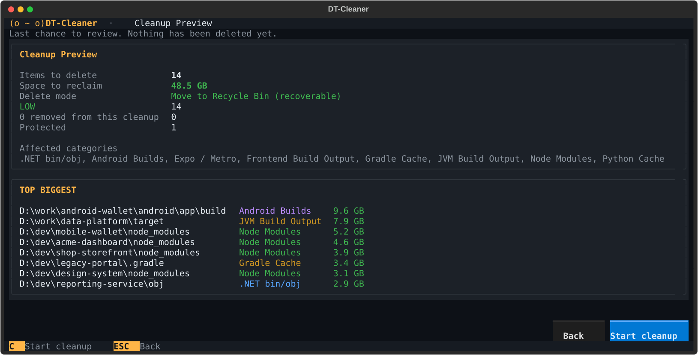
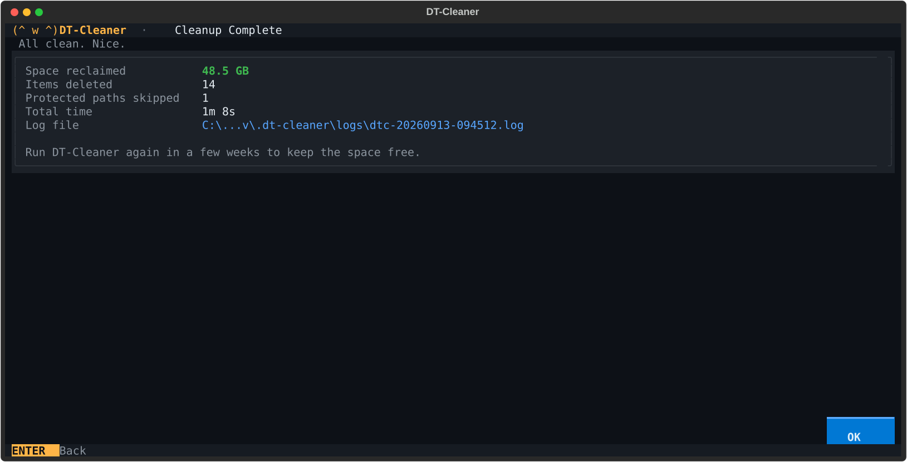
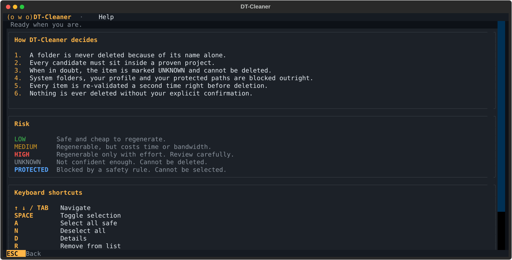
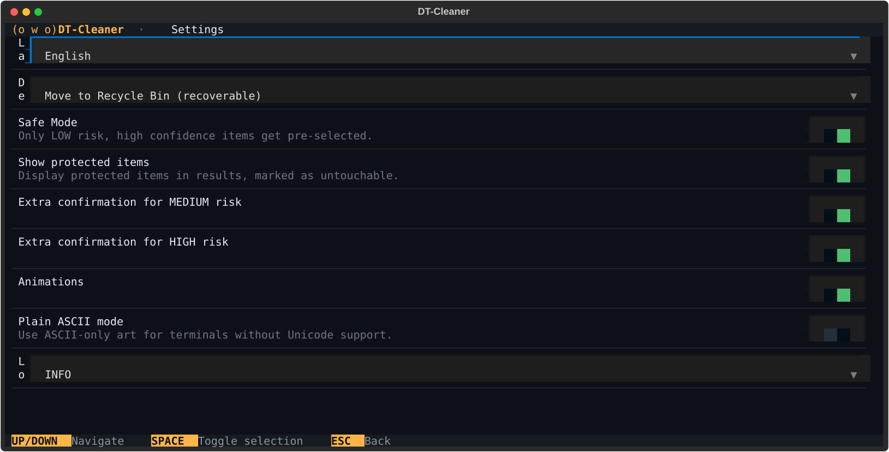

<div align="center">

```
 __   __
/  \_/  \
| o   o |     D T - C L E A N E R
|   w   |
 \_____/
```

# DT-Cleaner

**Reclaim dev disk space. Never delete in the dark.**

A terminal app that finds regenerable development artifacts — `node_modules`,
Rust `target`, Android build output, `.next`, `__pycache__`, .NET `bin`/`obj` —
and helps you delete them **safely**.

[](https://www.python.org/downloads/)
[](docs/platforms.md)
[](docs/platforms.md)
[](tests/)
[](LICENSE)

</div>

---

> **The one rule:** a folder is never deleted because of its name.
>
> A `build` folder with no project around it is not build output — it might be
> your photos. DT-Cleaner refuses to touch it. Every candidate must sit inside a
> **proven** project, pass five layers of protection, be selected by you, and
> survive a second validation performed immediately before deletion.



## Why

`node_modules` is famously the heaviest object in the universe. So is a Rust
`target` directory, and Gradle's build output, and every `.next` you have ever
generated. Between them they quietly eat hundreds of gigabytes that you could
get back with one command per project.

The problem is that deleting them in bulk is genuinely dangerous. `rm -rf` over
a glob has no idea that `dist/` in one folder is bundler output and in another
is a decade of client deliverables. DT-Cleaner is built around that distinction:
it is *conservative by architecture*, not by good intentions.

## Table of contents

- [Install](#install)
- [Quick start](#quick-start)
- [How it works](#how-it-works)
- [Screenshots](#screenshots)
- [What it finds](#what-it-finds)
- [Safety model](#safety-model)
- [Command line](#command-line)
- [Language](#language)
- [Files it creates](#files-it-creates)
- [Platform support](#platform-support)
- [Development](#development)
- [Contributing](#contributing)
- [License](#license)

## Install

Requires **Python 3.11+**. A terminal with UTF-8 helps (Windows Terminal,
iTerm2, any modern Linux terminal); there is a plain-ASCII fallback for the
rest.

```bash
git clone https://github.com/guimaraesdev0/DT-Cleaner.git
cd DT-Cleaner

python -m venv .venv
# Windows
.\.venv\Scripts\Activate.ps1
# Linux / macOS
source .venv/bin/activate

pip install -e .
```

Or install it globally with [pipx](https://pypa.github.io/pipx/):

```bash
pipx install git+https://github.com/guimaraesdev0/DT-Cleaner.git
```

## Quick start

```bash
dtc doctor    # check your terminal, permissions and platform support
dtc           # launch the app
```

If `dtc` is not on your PATH, `python -m dtcleaner` does the same thing.

**Want to try it without risking anything?** The repo ships a sandbox generator
that builds a fake project tree — including deliberate traps — so you can watch
the safety rules work:

```bash
python scripts/make_sandbox.py
dtc scan --path "<path it prints>"     # reports only, never deletes
```

## How it works

```
  1. Scan      →  2. Review     →  3. Preview    →  4. Clean     →  5. Summary
     six             select,          totals,         one item        reclaimed,
     phases          remove,          risks,          at a time,      failed,
                     protect          confirm         re-validated    log path
```

1. **Scan** — pick Quick (your usual project folders), Full (whole drives) or
   Custom. Cancel any time with `ESC`.
2. **Review** — Safe Mode pre-selects only LOW-risk items it is ≥85% confident
   about. Everything else waits for you. **Press `C` when you are happy with
   the selection** — the screen tells you so, bottom-left.
3. **Preview** — the last screen before anything happens. Nothing is deleted yet.
4. **Clean** — each item is re-checked against the safety rules *at deletion
   time*, then moved to the Recycle Bin (or trash).
5. **Summary** — what was reclaimed, what failed, and where the log is.

### The three actions that matter

On the results screen these do three different things:

| Key | Action | Scope |
|---|---|---|
| `SPACE` | select / deselect | this cleanup only |
| `R` | **remove from the list** | this cleanup only — the row disappears |
| `P` | **protect the path** | permanent — every future scan skips it |

Found 40 `node_modules` and want to keep 5? Press `R` on those five. Want a
client folder left alone forever? Press `P`.

### Keyboard

| Key | Action |
|---|---|
| **`C`** | **continue to the cleanup preview** |
| `↑` `↓` `TAB` | navigate |
| `SPACE` | toggle selection |
| `A` | select all **safe** items (never "all") |
| `N` | deselect everything |
| `D` | details — why it was detected |
| `R` | remove from the cleanup list |
| `P` | protect the path permanently |
| `/` | filter |
| `ESC` | back / cancel |
| `Q` | quit |

## Screenshots

<details open>
<summary><b>Scanning</b> — live feed of what it finds, as it finds it</summary>


</details>

<details>
<summary><b>Home</b></summary>


</details>

<details>
<summary><b>Item details</b> — every detection explains itself</summary>


</details>

<details>
<summary><b>Cleanup preview</b> — the last stop before deletion</summary>


</details>

<details>
<summary><b>Summary</b></summary>


</details>

<details>
<summary><b>Help</b> and <b>Settings</b></summary>



</details>

> Screenshots are generated from the running app by
> [`scripts/make_screenshots.py`](scripts/make_screenshots.py) using synthetic
> data — no mockups, and no one's real drive.

## What it finds

| Ecosystem | Detected by name | Requires a project marker |
|---|---|---|
| **Node / frontend** | `node_modules`, `.next`, `.nuxt`, `.turbo`, `.svelte-kit`, `.angular`, `.parcel-cache`, `.vite`, `storybook-static` | `dist`, `build`, `out`, `coverage` |
| **Android / RN / Expo** | `.expo`, `.expo-shared`, `.metro`, `.cxx` | `android/build`, `app/build` |
| **Python** | `__pycache__`, `.pytest_cache`, `.mypy_cache`, `.ruff_cache`, `.tox`, `*.egg-info` | `build`, `dist` |
| **Rust** | — | `target` (needs `Cargo.toml`) |
| **.NET** | — | `bin`, `obj` (need `.sln` / `.csproj`) |
| **JVM** | `.gradle` (project-local) | `target`, `build`, `out` |

Virtual environments (`.venv`, `venv`) are **deliberately never detected** —
they are slow to rebuild and often hold pinned or patched packages.

Adding another ecosystem is about 30 lines: see
[`docs/detectors.md`](docs/detectors.md).

## Safety model

Full detail in **[`docs/safety.md`](docs/safety.md)**. The short version:

| Layer | What it blocks |
|---|---|
| **1 — System paths** | Drive roots, `%SystemRoot%`, `Program Files`, `/usr`, `/etc`, `/System`, every user profile root. Nothing less than two levels below a drive root is ever deletable. |
| **2 — Sensitive files** | A folder holding `.env`, a lockfile, a keystore, a certificate or a database is protected no matter how it was detected. |
| **3 — Your protected paths** | Matched component by component, so `C:\dev-old` is *not* inside `C:\dev`. |
| **4 — Project context** | Ambiguous names need a proven marker nearby. Below 60% confidence an item becomes `UNKNOWN` and cannot be selected at all. |
| **5 — Your confirmation** | Nothing is ever deleted automatically. |

Plus:

- **Junctions and symlinks are never followed, sized, or deleted.** Deleting a
  junction can wipe its target.
- **Paths are canonicalized** before any comparison — `..`, 8.3 short names and
  casing cannot slip anything past the denylist.
- **The Recycle Bin is the default** and never silently falls back to permanent
  deletion. Permanent mode requires typing a confirmation word.
- **Every item is re-validated from disk immediately before it is removed** —
  covering the window between the scan and your confirmation.
- **`CleanupEngine.execute()` accepts a plan and nothing else.** There is no
  "delete this path" function anywhere in the codebase.

### Risk levels

| Level | Meaning |
|---|---|
| `LOW` | Safe and cheap to regenerate |
| `MEDIUM` | Regenerable, but costs time or bandwidth |
| `HIGH` | Regenerable only with effort — never auto-selected |
| `UNKNOWN` | Not confident enough — **cannot be deleted** |
| `PROTECTED` | Blocked by a safety rule — cannot even be selected |

## Command line

```bash
dtc                              # interactive app
dtc doctor                       # diagnostics
dtc scan                         # quick scan, report only
dtc scan --full                  # every fixed drive
dtc scan --path ~/dev            # a specific folder
dtc scan --limit 50

dtc protected list
dtc protected add ~/dev/important-client
dtc protected remove ~/dev/important-client

dtc history
dtc settings --lang pt_br
dtc --version
```

> **`dtc scan` never deletes anything.** It reports and stops, and there is no
> flag to change that. Deletion only happens through the interactive review and
> confirmation flow — nobody can put an unattended cleanup in a cron job.

## Language

English and Brazilian Portuguese, switchable at runtime from
`Settings → Language` or with `dtc settings --lang pt_br`. No restart.

Adding a language is one JSON file in
[`dtcleaner/i18n/locales/`](dtcleaner/i18n/locales/) — a test fails if any key
is missing from a translation.

## Files it creates

```
~/.dt-cleaner/
├── config.json          settings + protected paths
├── history.db           scan and cleanup history (SQLite)
└── logs/
    ├── dtc-*.log        human-readable log
    └── dtc-*.jsonl      structured audit log
```

Nothing is written anywhere else.

## Platform support

| Platform | Status |
|---|---|
| Windows 10 / 11 | ✅ Supported and tested |
| Linux | 🧪 Experimental |
| macOS | 🧪 Experimental |

`dtc doctor` tells you which one you are on. See
**[`docs/platforms.md`](docs/platforms.md)** for exactly what works, what was
recently fixed, and what still needs doing — **running the test suite on Linux
or macOS is the single most useful contribution right now.**

## Development

```bash
pip install -e ".[dev]"
pytest -q                     # 248 tests
pytest -q --cov=dtcleaner     # with coverage
```

```
dtcleaner/
├── cli.py                 Typer CLI
├── core/
│   ├── safety.py          ⚠ the Safety Engine — read docs/safety.md first
│   ├── constants.py       denylists, ambiguous names, project markers
│   ├── confidence.py      scoring + classification pipeline
│   ├── scanner.py         phased, cancellable walk
│   ├── cleanup.py         the ONLY code that deletes
│   ├── detectors/         one module per ecosystem
│   └── validators/        project context resolution
├── i18n/                  translator + en.json / pt_br.json
├── services/              disks, trash, history
├── ui/                    Textual screens, theme, BYTE
└── utils/                 paths, formatting, concurrency
```

Useful docs:

- [`docs/safety.md`](docs/safety.md) — the safety contract (normative)
- [`docs/detectors.md`](docs/detectors.md) — adding an ecosystem
- [`docs/platforms.md`](docs/platforms.md) — cross-platform status
- [`docs/mascot.md`](docs/mascot.md) — BYTE, and the rules for using him

## Contributing

Contributions are welcome — see [CONTRIBUTING.md](CONTRIBUTING.md).

One rule above all: **a change that can make DT-Cleaner delete something it
previously refused to delete needs a test proving the new case is safe.** The
suite is the safety net, and it is meant to be hard to get past.

## License

[MIT](LICENSE)

---

<div align="center">
<sub>Meet <b>BYTE</b>, the watchdog. A dog named BYTE, who does not <i>bite</i> anything without permission.</sub>
</div>
